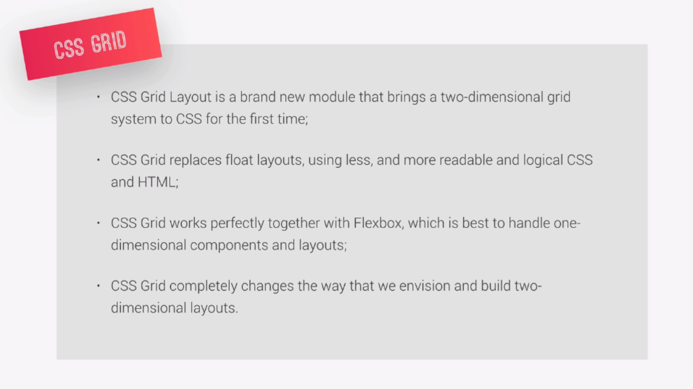
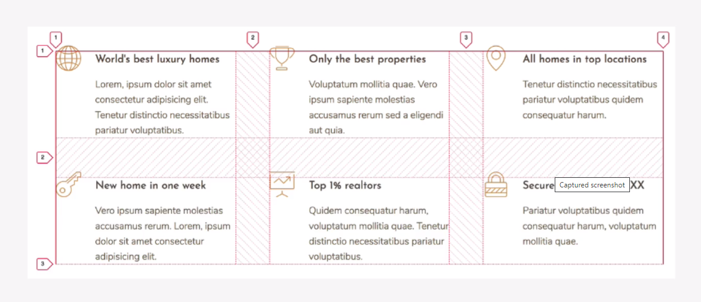
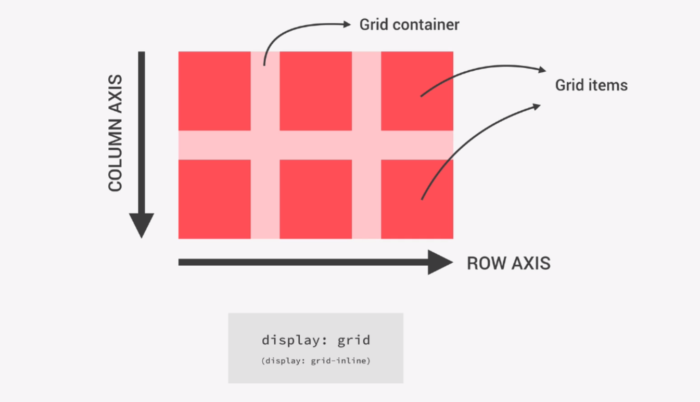
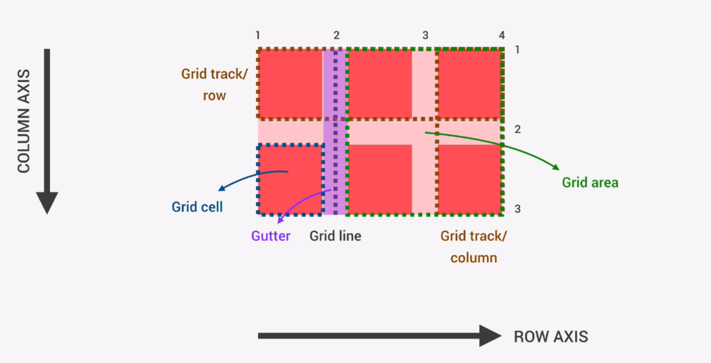
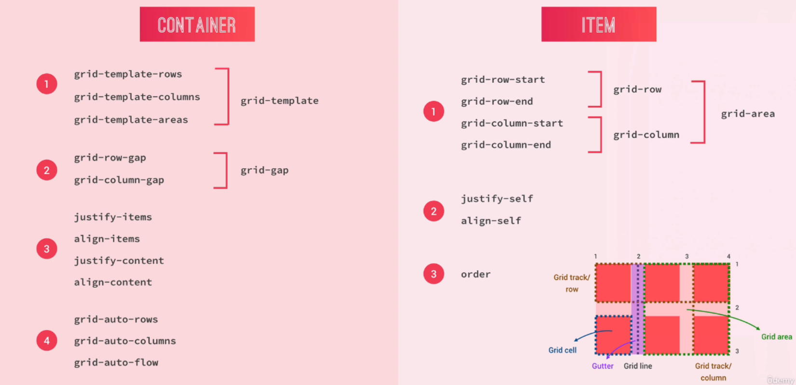

# A Whole New Mindset



### Building a simple two dimensional layout, like this one. 



# CSS Grid Terminology
The row axis in the x direction and the column axis in the y direction, and this axes are always the same. We cannot change where they are like we do with flexbox, which makes it a bit simpler actually. So, row axis and column axis. 



The Space between two grid lines is called a **track**, no matter if it's vertical or horizontal.
The area between two vertical and two horizontal grid lines is called a **grid area**, and if that area is between two adjacent grid lines and two adjacent column lines, then that afea is just called a grid cell.



# CSS Grid Properties Overview

A quick overview of all the CSS Grid related properties for both the grid container and the grid items.



### Shortkey for 

```
.container>.item.item--$*6
```
Result:

```
<div class="container">
  <div class="item item--1"></div>
  <div class="item item--2"></div>
  <div class="item item--3"></div>
  <div class="item item--4"></div>
  <div class="item item--5"></div>
  <div class="item item--6"></div>
</div>
```

## Grid align track 
The **align** part of the name always means the "vertical direction", or the "column" axis, So **align-content** and also **align-items** means the **vertical direction**. And the **justify** always means that its the "horizontal direction", so the "row axis", both for j**ustify-items** and **justify-content**.

## Responsive Layout with auto-fit and auto-fill 

The **auto-fill**, it actually creates 10 columns so as many as fit in here, while with **auto-fit** it still creates these 10 columns, but then collapse the ones that are empty to have a width of zero.

Reffrence for icon:
> https://icomoon.io/

shrtkey
> .features{feature $}*6